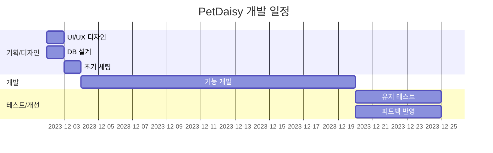

# 🌼 PetDaisy

  
  
  ### 반려동물의 건강과 일상을 더 쉽고 체계적으로 기록하는 스마트 헬스케어 다이어리
  
  <a href="[배포링크]">🔗 배포 링크</a> &nbsp; | &nbsp; 
  <a href="[회고링크]">📝 프로젝트 회고</a> &nbsp; | &nbsp;
  <a href="[기술문서]">📚 기술 문서</a>
  

---

## 💫 프로젝트 소개

펫데이지는 소중한 반려동물의 건강 여정을 함께하는 똑똑한 건강 관리 플랫폼입니다.
체중 변화부터 병원 진료 기록, 예방접종 일정까지 한눈에 확인할 수 있어 더욱 건강한 반려생활을 도와드립니다.
또한 일상의 특별한 순간들을 사진과 함께 기록할 수 있어, 반려동물과의 소중한 추억을 오래도록 간직할 수 있습니다.

 

## ⚡️ 주요 기능

| 기능 | 설명 |
|------|------|
| 📝 프로필 관리 | 반려동물의 기본 정보를 등록하고 관리할 수 있습니다 |
| ⚖️ 체중 기록 | 반려동물의 체중 변화를 그래프로 한눈에 확인할 수 있습니다 |
| 🏥 진료 기록 | 병원 방문 기록과 진료 내용을 체계적으로 관리할 수 있습니다 |
| 💉 예방접종 | 예방접종 일정을 등록하고 알림을 받을 수 있습니다 |
| 🤒 증상 기록 | 특이사항이나 증상을 사진과 함께 기록할 수 있습니다 |

 

## 🛠 기술 스택

### Frontend

### State Management & Data Fetching

### Form & UI

 

## 👥 팀원 소개

|  **조민수** |  **한효림** |
|:-------------------:|:-------------------:|
| • 메인 페이지 | • 로그인/회원가입 |
| • 공통 컴포넌트 | • 헤더/푸터 |
| • 동물 등록 | • 증상 기록 |
| • 진료 기록 | • 몸무게 기록 |
| • 예방 접종 | |

 

## ⏰ 개발 일정

 

## 💡 기술적 의사결정

### Next.js (App Router)
- 서버 컴포넌트와 클라이언트 컴포넌트의 효과적인 분리
- 직관적인 페이지 라우팅
- SSR을 통한 초기 로딩 속도 개선 및 SEO 최적화

### Tanstack Query
- 강력한 서버 상태 관리
- 자동 캐싱과 데이터 동기화
- 백그라운드 데이터 업데이트
- 직관적인 에러 처리와 로딩 상태 관리

### Zustand
- 가벼운 번들 사이즈
- 간단한 설정
- TypeScript와의 뛰어난 호환성

### React Hook Form
- 비제어 컴포넌트 방식으로 성능 최적화
- 직관적인 폼 유효성 검사
- 간편한 에러 처리

 

## 📱 스크린샷

  
  
  

---
*더 나은 반려생활을 위한 우리의 여정은 계속됩니다* 🐾
