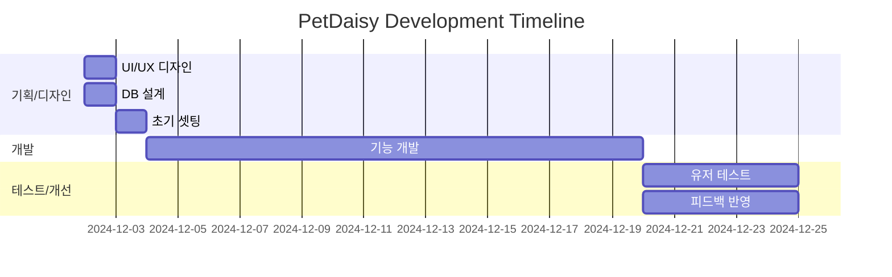

# 🌼 PetDaisy

  

  <h3>반려동물의 건강과 일상을 체계적으로 기록하는 스마트 헬스케어 다이어리</h3>

  
  

## 🎯 About PetDaisy
펫데이지는 소중한 반려동물의 건강 여정을 함께하는 똑똑한 건강 관리 플랫폼입니다. 
체중 변화부터 병원 진료 기록, 예방접종 일정까지 한눈에 확인할 수 있어 더욱 건강한 반려생활을 도와드립니다.

## ✨ 주요 기능
| 기능 | 설명 |
|:---:|---|
| 🏷️ 프로필 관리 | 반려동물의 기본 정보를 등록하고 관리 |
| ⚖️ 체중 기록 | 반려동물의 체중 변화를 그래프로 시각화 |
| 🏥 진료 기록 | 병원 방문 기록과 진료 내용을 체계적으로 관리 |
| 💉 예방접종 | 예방접종 일정을 등록하고 알림 서비스 제공 |
| 📝 증상 기록 | 특이사항이나 증상을 사진과 함께 기록 |

## 👨‍👩‍👦‍👦 Team Members

|  **조민수** |  **한효림** |
|:---:|:---:|
|  |  |
| 메인 페이지 공통 컴포넌트 동물 등록 진료 기록 예방 접종 | 초기 셋팅 로그인/회원가입 헤더/푸터 증상 기록 몸무게 기록 |

## ⏰ 개발 일정

```mermaid
gantt
    dateFormat  YYYY-MM-DD
    title       PetDaisy Development Timeline
    
    section 기획/디자인
    UI/UX 디자인    :2024-12-02, 1d
    DB 설계        :2024-12-02, 1d
    초기 셋팅      :2024-12-03, 1d
    
    section 개발
    기능 개발      :2024-12-04, 16d
    
    section 테스트/개선
    유저 테스트    :2024-12-20, 5d
    피드백 반영    :2024-12-20, 5d
```

## 🛠️ 기술 스택

| Category | Technologies Used |
|:---:|:---|
| **Frontend** |    |
| **상태관리** |   |
| **배포** |  |

## 📊 유저 테스트
| 항목 | 내용 |
|:---:|---|
| 📅 진행 일시 | 2024.12.20 - 2024.12.21 |
| 👥 참여 인원 | 4명 |
| 💻 테스트 환경 | • iOS (모바일/Safari) • Mac (데스크톱/Chrome) • Windows (데스크톱/Chrome) |
| ⭐ 전반적 만족도 | **4.25/5** |
| 💬 주요 피드백 | • 깔끔한 디자인 • 직관적인 UI • 빠른 반응성 |

## 📱 Screenshots

## 1. 메인 대시보드
전체 화면 캡처

### 상단 영역
펫 정보, 마지막 진료일, 몸무게, 진료기록

### 하단 영역
예방접종 기록, 관찰 기록, 반려동물 삭제

---

  <i>더 나은 반려생활을 위한 우리의 여정은 계속됩니다</i> 🐾 
  Made with 💖 by Team PetDaisy

